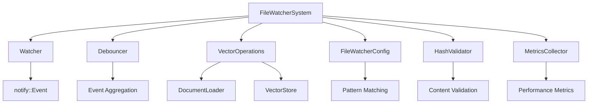
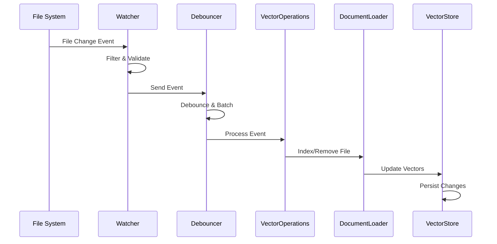

# 📁 File Watcher Architecture Documentation

## 🎯 Overview

The File Watcher system is a real-time file monitoring component of the Vectorizer that tracks changes in indexed files and updates the vector database automatically. It provides incremental reindexing capabilities to maintain data consistency without requiring full system restarts.

## 🏗️ System Architecture

### **Core Components**



### **Component Responsibilities**

#### 1. **FileWatcherSystem** (`mod.rs`)
- **Purpose**: Main orchestrator and entry point
- **Responsibilities**:
  - System initialization and lifecycle management
  - Component coordination
  - Event flow orchestration
  - Graceful shutdown handling

#### 2. **Watcher** (`watcher.rs`)
- **Purpose**: File system event detection
- **Responsibilities**:
  - Cross-platform file monitoring using `notify` crate
  - Event filtering and preprocessing
  - Path validation and exclusion
  - Event channel management

#### 3. **Debouncer** (`debouncer.rs`)
- **Purpose**: Event aggregation and rate limiting
- **Responsibilities**:
  - Event batching and debouncing
  - Duplicate event prevention
  - Processing queue management
  - Callback execution scheduling

#### 4. **VectorOperations** (`operations.rs`)
- **Purpose**: Vector database operations
- **Responsibilities**:
  - File change event processing
  - Document indexing and removal
  - Collection management
  - Error handling and recovery

#### 5. **FileWatcherConfig** (`config.rs`)
- **Purpose**: Configuration and pattern matching
- **Responsibilities**:
  - Include/exclude pattern validation
  - File type filtering
  - Configuration management
  - Silent filtering for performance

## 🔄 Event Flow

### **Event Processing Pipeline**



### **Event Types**

#### **FileChangeEvent Enum**
```rust
pub enum FileChangeEvent {
    Created(PathBuf),    // New file created
    Modified(PathBuf),   // Existing file modified
    Deleted(PathBuf),    // File removed
    Renamed(PathBuf, PathBuf), // File renamed/moved
}
```

#### **Event Conversion Logic**
```rust
// Critical fix: Access events converted to empty path to prevent loops
EventKind::Access(_) => FileChangeEvent::Modified(PathBuf::new())
```

## ⚙️ Configuration

### **Workspace Configuration** (`vectorize-workspace.yml`)

```yaml
global_settings:
  file_watcher:
    watch_paths:
      - "/path/to/monitor"
    auto_discovery: true
    enable_auto_update: true
    hot_reload: true
    exclude_patterns:
      - "**/.git/**"
      - "**/target/**"
      - "**/node_modules/**"
      - "**/*.log"
      - "**/data/**"
```

### **Pattern Matching**

#### **Include Patterns**
- Define which files should be monitored
- Support glob patterns: `**/*.md`, `docs/**/*.rs`
- Applied per project/collection

#### **Exclude Patterns**
- Define which files should be ignored
- Global patterns for system files
- Performance optimization for large directories

## 🛡️ Error Handling & Recovery

### **Error Categories**

1. **File System Errors**
   - Permission denied
   - File not found
   - I/O errors

2. **Processing Errors**
   - Invalid file format
   - Parsing failures
   - Vector generation errors

3. **System Errors**
   - Memory allocation failures
   - Channel communication errors
   - Configuration errors

### **Recovery Strategies**

- **Graceful Degradation**: Continue processing other files
- **Retry Logic**: Exponential backoff for transient errors
- **Error Logging**: Comprehensive error tracking
- **Circuit Breakers**: Prevent cascade failures

## 📊 Performance Optimization

### **Debouncing Strategy**
- **Default Delay**: 1 second
- **Batch Processing**: Multiple events in single operation
- **Duplicate Prevention**: Skip recently processed files

### **Memory Management**
- **Lazy Loading**: Load files only when needed
- **Streaming Processing**: Handle large files efficiently
- **Resource Cleanup**: Proper disposal of temporary resources

### **I/O Optimization**
- **Selective Monitoring**: Only watch relevant directories
- **Pattern Pre-filtering**: Reduce event processing overhead
- **Silent Filtering**: Avoid log spam for excluded files

## 🔧 Key Fixes Implemented

### **1. Self-Detection Loop Prevention**
```rust
// Before: Access events caused infinite loops
EventKind::Access(_) => FileChangeEvent::Modified(path.clone())

// After: Access events ignored
EventKind::Access(_) => FileChangeEvent::Modified(PathBuf::new())
```

### **2. Empty Path Filtering**
```rust
// Skip events with empty paths (ignored events like Access)
if path.as_os_str().is_empty() || path.to_string_lossy().is_empty() {
    return Ok(());
}
```

### **3. Silent Filtering**
```rust
// Prevent log spam for excluded files
pub fn should_process_file_silent(&self, path: &Path) -> bool {
    // Same logic as should_process_file but without logging
}
```

## 🧪 Testing Strategy

### **Unit Tests**
- Individual component testing
- Mock file system events
- Configuration validation

### **Integration Tests**
- End-to-end event processing
- Real file system operations
- Performance benchmarks

### **Load Testing**
- High-frequency file changes
- Large directory monitoring
- Memory usage validation

## 📈 Monitoring & Metrics

### **Key Metrics**
- **Event Processing Rate**: Events per second
- **File Processing Time**: Average processing duration
- **Error Rate**: Failed operations percentage
- **Memory Usage**: System resource consumption

### **Health Checks**
- **File Watcher Status**: Active/inactive state
- **Event Queue Size**: Pending events count
- **Last Processed Event**: Timestamp tracking
- **Configuration Validity**: Pattern validation

## 🚀 Deployment Considerations

### **Production Requirements**
- **Resource Limits**: CPU and memory constraints
- **Logging Configuration**: Appropriate log levels
- **Error Alerting**: Monitoring and notifications
- **Backup Strategy**: Data persistence planning

### **Scalability**
- **Directory Size Limits**: Maximum monitored directories
- **File Count Limits**: Maximum files per directory
- **Event Rate Limits**: Maximum events per second
- **Memory Growth**: Long-running process stability

## 🔮 Future Enhancements

### **Planned Features**
- **Distributed Monitoring**: Multi-node file watching
- **Advanced Filtering**: Content-based filtering
- **Performance Tuning**: Dynamic debounce adjustment
- **Analytics Integration**: Usage pattern analysis

### **Optimization Opportunities**
- **Event Batching**: Improved aggregation strategies
- **Parallel Processing**: Multi-threaded event handling
- **Caching**: Intelligent file content caching
- **Compression**: Reduced memory footprint

---

**Last Updated**: October 10, 2025  
**Version**: 1.0  
**Status**: ✅ Production Ready
