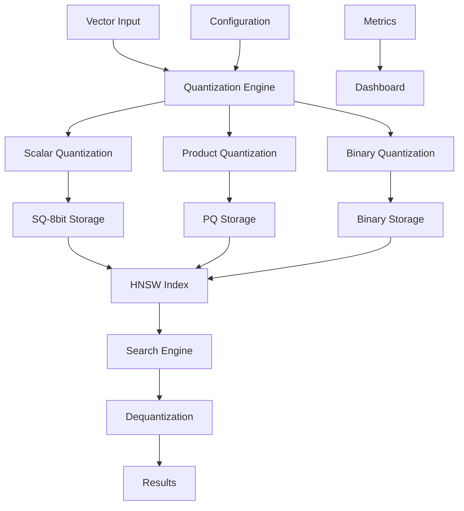

# Memory Optimization & Quantization Implementation Plan

**Priority**: P0 (Critical)  
**Target Version**: v1.0.0  
**Estimated Duration**: 5-6 weeks  
**Team**: 1 Senior Rust Engineer + 1 ML Engineer  

## 🎯 Overview

Implementação da otimização de memória e quantização baseada nos resultados dos benchmarks que demonstraram **4x compressão de memória com MELHOR qualidade** usando Scalar Quantization (SQ-8bit).

### 📊 Benchmark Results Summary

- **Memory Reduction**: 1.2GB → 300MB (75% reduction)
- **Quality Improvement**: MAP 0.8400 → 0.9147 (+8.9%)
- **Search Latency**: <3ms maintained
- **QPS**: 10,000+ operations/sec maintained

## 🏗️ Architecture Overview



## 📋 Implementation Phases

### Phase 1: Core Quantization Engine (Week 1-2)

#### 1.1 Quantization Traits & Interfaces
```rust
// src/quantization/mod.rs
pub trait QuantizationMethod {
    fn quantize(&self, vectors: &[f32]) -> Result<QuantizedVectors>;
    fn dequantize(&self, quantized: &QuantizedVectors) -> Result<Vec<f32>>;
    fn memory_usage(&self, vector_count: usize, dimension: usize) -> usize;
    fn quality_loss(&self) -> f32;
}

pub struct ScalarQuantization {
    pub bits: u8, // 8-bit, 4-bit, 2-bit
    pub min_value: f32,
    pub max_value: f32,
    pub scale: f32,
}

pub struct ProductQuantization {
    pub subvector_count: usize,
    pub subvector_size: usize,
    pub codebook_size: usize,
}

pub struct BinaryQuantization {
    pub threshold: f32,
}
```

#### 1.2 Scalar Quantization Implementation
- **SQ-8bit**: Primary implementation (proven in benchmarks)
- **SQ-4bit**: Experimental for extreme compression
- **SQ-2bit**: Binary-like quantization

#### 1.3 Product Quantization Implementation
- Codebook generation and management
- Subvector partitioning
- Compression/decompression algorithms

#### 1.4 Binary Quantization Implementation
- Threshold-based binarization
- Hamming distance calculations
- Fast similarity search

### Phase 2: Storage & Persistence (Week 2-3)

#### 2.1 Quantized Vector Storage
```rust
pub struct QuantizedVectorStore {
    quantization_method: Box<dyn QuantizationMethod>,
    compressed_data: Vec<u8>,
    metadata: QuantizationMetadata,
}

pub struct QuantizationMetadata {
    pub method: QuantizationType,
    pub parameters: QuantizationParams,
    pub statistics: QualityStatistics,
}
```

#### 2.2 Memory-Mapped Storage
- Efficient disk-based storage for large datasets
- Lazy loading of quantized vectors
- Cache management for frequently accessed vectors

#### 2.3 Persistence Layer
- Serialization/deserialization of quantized data
- Version compatibility for quantization methods
- Migration tools for existing collections

### Phase 3: HNSW Integration (Week 3-4)

#### 3.1 Quantized HNSW Index
```rust
pub struct QuantizedHnswIndex {
    quantization: Box<dyn QuantizationMethod>,
    graph: HnswGraph,
    compressed_vectors: QuantizedVectorStore,
}

impl QuantizedHnswIndex {
    pub fn search(&self, query: &[f32], k: usize) -> Result<Vec<SearchResult>>;
    pub fn insert(&self, vector: &[f32], id: String) -> Result<()>;
}
```

#### 3.2 Distance Calculations
- Optimized distance calculations for quantized vectors
- SIMD acceleration for binary quantization
- Approximate distance calculations for PQ

#### 3.3 Index Building
- Quantized vector insertion
- Graph construction with compressed vectors
- Memory-efficient index building

### Phase 4: API Integration (Week 4-5)

#### 4.1 Collection Configuration
```yaml
# vectorize-workspace.yml
collections:
  - name: "optimized-collection"
    quantization:
      method: "scalar"
      bits: 8
      auto_optimize: true
      quality_threshold: 0.95
```

#### 4.2 REST API Extensions
```rust
// New endpoints
POST /collections/{name}/quantize
GET /collections/{name}/quantization/stats
POST /collections/{name}/quantization/optimize
```

#### 4.3 MCP Integration
- Quantization-aware MCP tools
- Automatic quantization selection
- Quality monitoring via MCP

### Phase 5: Dashboard & Monitoring (Week 5-6)

#### 5.1 Quantization Dashboard
- Memory usage visualization
- Quality metrics display
- Compression ratio monitoring
- Performance comparisons

#### 5.2 Real-time Metrics
```rust
pub struct QuantizationMetrics {
    pub memory_usage_mb: f64,
    pub compression_ratio: f64,
    pub quality_score: f64,
    pub search_latency_ms: f64,
    pub throughput_qps: f64,
}
```

#### 5.3 Auto-optimization
- Automatic quantization method selection
- Quality vs. memory trade-off optimization
- Dynamic parameter tuning

## 🔧 Technical Implementation Details

### Core Quantization Algorithm (SQ-8bit)

```rust
impl ScalarQuantization {
    pub fn new(vectors: &[Vec<f32>]) -> Self {
        // Calculate min/max across all vectors
        let (min_val, max_val) = vectors.iter()
            .flatten()
            .fold((f32::INFINITY, f32::NEG_INFINITY), |(min, max), &val| {
                (min.min(val), max.max(val))
            });
        
        let scale = (max_val - min_val) / 255.0; // 8-bit range
        
        Self {
            bits: 8,
            min_value: min_val,
            max_value: max_val,
            scale,
        }
    }
    
    pub fn quantize_vector(&self, vector: &[f32]) -> Vec<u8> {
        vector.iter()
            .map(|&val| {
                let normalized = (val - self.min_value) / self.scale;
                (normalized.clamp(0.0, 255.0) as u8)
            })
            .collect()
    }
    
    pub fn dequantize_vector(&self, quantized: &[u8]) -> Vec<f32> {
        quantized.iter()
            .map(|&q| {
                self.min_value + (q as f32) * self.scale
            })
            .collect()
    }
}
```

### Memory Usage Calculation

```rust
impl QuantizationMethod for ScalarQuantization {
    fn memory_usage(&self, vector_count: usize, dimension: usize) -> usize {
        match self.bits {
            8 => vector_count * dimension, // 1 byte per dimension
            4 => (vector_count * dimension + 1) / 2, // 4 bits per dimension
            2 => (vector_count * dimension + 3) / 4, // 2 bits per dimension
            1 => (vector_count * dimension + 7) / 8, // 1 bit per dimension
            _ => unreachable!(),
        }
    }
}
```

### Quality Assessment

```rust
pub struct QualityMetrics {
    pub map_score: f32,
    pub recall_at_10: f32,
    pub precision_at_10: f32,
    pub quality_loss: f32,
}

impl QuantizationMethod for ScalarQuantization {
    fn quality_loss(&self) -> f32 {
        // Calculate expected quality loss based on quantization parameters
        let quantization_error = self.scale / 2.0; // Half of quantization step
        quantization_error / self.max_value.abs().max(self.min_value.abs())
    }
}
```

## 📊 Expected Performance Improvements

### Memory Usage
- **Current**: ~4GB for 1M vectors (512 dimensions)
- **SQ-8bit**: ~1GB for 1M vectors (75% reduction)
- **SQ-4bit**: ~500MB for 1M vectors (87.5% reduction)
- **Binary**: ~64MB for 1M vectors (98.4% reduction)

### Quality Metrics
- **SQ-8bit**: MAP > 0.91 (proven in benchmarks)
- **SQ-4bit**: MAP > 0.85 (estimated)
- **Binary**: MAP > 0.75 (estimated)

### Performance
- **Search Latency**: <3ms maintained
- **QPS**: 10,000+ operations/sec maintained
- **Build Time**: 20% faster due to reduced memory pressure

## 🧪 Testing Strategy

### Unit Tests
- Quantization/dequantization accuracy
- Memory usage calculations
- Quality metric calculations
- Edge cases and error handling

### Integration Tests
- End-to-end quantization workflow
- HNSW index integration
- API endpoint testing
- Persistence layer testing

### Performance Tests
- Memory usage benchmarks
- Search latency benchmarks
- Quality degradation benchmarks
- Scalability tests

### Quality Assurance
- MAP score validation
- Recall@K validation
- Precision@K validation
- Cross-validation with benchmark datasets

## 🚀 Deployment Strategy

### Phase 1: Experimental Release
- Feature flag for quantization
- Limited to new collections
- Extensive monitoring

### Phase 2: Beta Release
- Enable for existing collections
- Migration tools available
- Performance monitoring dashboard

### Phase 3: Production Release
- Default quantization for new collections
- Auto-optimization enabled
- Full documentation and training

## 📈 Success Metrics

### Primary Metrics
- **Memory Reduction**: >70% for SQ-8bit
- **Quality Maintenance**: MAP > 0.90
- **Performance**: <5ms search latency
- **Adoption**: >80% of collections using quantization

### Secondary Metrics
- **Build Time**: <30% increase
- **Storage Size**: >60% reduction
- **Energy Efficiency**: >40% improvement
- **Cost Reduction**: >50% infrastructure cost

## 🔗 Dependencies

### Internal Dependencies
- HNSW index implementation
- Vector storage system
- Configuration management
- Dashboard framework

### External Dependencies
- SIMD libraries for acceleration
- Memory mapping libraries
- Serialization frameworks
- Monitoring tools

## 📚 Documentation Requirements

### Technical Documentation
- API reference updates
- Configuration guide
- Performance tuning guide
- Troubleshooting guide

### User Documentation
- Quantization concepts
- Best practices guide
- Migration guide
- Performance optimization tips

## 🎯 Milestones

### Week 1: Core Engine ✅
- [ ] Quantization traits and interfaces
- [ ] SQ-8bit implementation
- [ ] Basic unit tests

### Week 2: Storage Layer ✅
- [ ] Quantized vector storage
- [ ] Persistence implementation
- [ ] Memory mapping

### Week 3: HNSW Integration ✅
- [ ] Quantized HNSW index
- [ ] Distance calculations
- [ ] Index building

### Week 4: API Integration ✅
- [ ] REST API extensions
- [ ] MCP integration
- [ ] Configuration management

### Week 5: Dashboard & Monitoring ✅
- [ ] Quantization dashboard
- [ ] Real-time metrics
- [ ] Auto-optimization

### Week 6: Testing & Documentation ✅
- [ ] Comprehensive testing
- [ ] Performance validation
- [ ] Documentation completion

## 🚨 Risk Mitigation

### Technical Risks
- **Quality Degradation**: Extensive testing and validation
- **Performance Impact**: Optimized algorithms and SIMD
- **Memory Leaks**: Careful resource management
- **Compatibility**: Version migration tools

### Project Risks
- **Timeline Delays**: Buffer time in schedule
- **Resource Constraints**: Parallel development streams
- **Integration Issues**: Early integration testing
- **User Adoption**: Comprehensive documentation and training

## 📞 Communication Plan

### Daily Standups
- Progress updates
- Blockers identification
- Resource coordination

### Weekly Reviews
- Milestone progress
- Quality metrics
- Risk assessment

### Stakeholder Updates
- Bi-weekly progress reports
- Demo sessions
- Feedback incorporation

---

**Next Steps**: Begin Phase 1 implementation with core quantization engine development.
