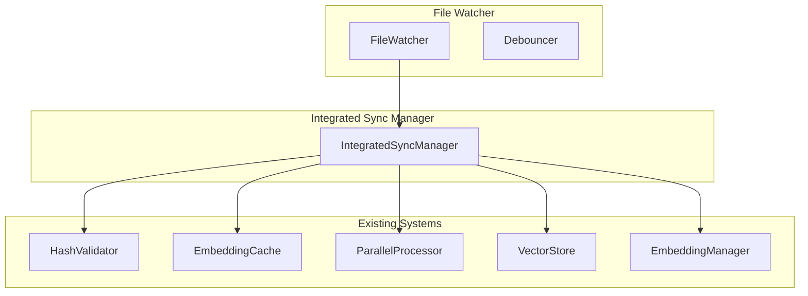

# File Watcher Integration Guide

## Overview

The integrated file watcher system provides file change detection and cache synchronization while **reusing existing Vectorizer systems** instead of duplicating functionality. This follows the governance principle of maintaining clean, non-duplicated code.

## Key Principles

### ✅ **DO: Reuse Existing Systems**
- Use existing `HashValidator` for content change detection
- Use existing `EmbeddingCache` for cache operations
- Use existing `ParallelProcessor` for background processing
- Use existing `VectorStore` for vector operations
- Use existing `EmbeddingManager` for embedding generation

### ❌ **DON'T: Duplicate Functionality**
- Don't create new hash validation systems
- Don't create new cache systems
- Don't create new work queue systems
- Don't create new metrics systems

## Architecture



## Usage

### 1. Basic Setup

```rust
use vectorizer::file_watcher::{
    IntegratedSyncManager, IntegratedSyncConfig,
    HashValidator, FileWatcherConfig
};
use vectorizer::embedding::cache::{EmbeddingCache, CacheConfig};
use vectorizer::embedding::EmbeddingManager;
use vectorizer::db::VectorStore;
use vectorizer::parallel::ParallelProcessor;

// Create existing systems
let hash_validator = Arc::new(HashValidator::new());
let embedding_cache = Arc::new(EmbeddingCache::new(CacheConfig::default())?);
let vector_store = Arc::new(VectorStore::new());
let embedding_manager = Arc::new(RwLock::new(EmbeddingManager::new()));
let parallel_processor = Arc::new(ParallelProcessor::new());

// Configure integrated sync
let config = IntegratedSyncConfig {
    enable_proactive_invalidation: true,
    enable_atomic_updates: true,
    max_concurrent_operations: 4,
    max_retry_attempts: 3,
    retry_delay_ms: 1000,
    enable_metrics: true,
};

// Create integrated sync manager
let sync_manager = IntegratedSyncManager::new(
    config,
    hash_validator,
    embedding_cache,
    vector_store,
    embedding_manager,
    parallel_processor,
);
```

### 2. Processing File Changes

```rust
use vectorizer::file_watcher::{FileChangeEvent, FileChangeEventWithMetadata};

// Create a file change event
let event = FileChangeEventWithMetadata {
    event: FileChangeEvent::Created(PathBuf::from("docs/architecture/design.md")),
    timestamp: chrono::Utc::now(),
    content_hash: Some("abc123".to_string()),
    file_size: Some(1024),
};

// Process the event
sync_manager.process_file_change(&event).await?;
```

### 3. Integration with Existing File Watcher

```rust
use vectorizer::file_watcher::{Watcher, FileWatcherConfig, Debouncer};

// Create file watcher with existing components
let watcher_config = FileWatcherConfig {
    watch_paths: vec![PathBuf::from("/path/to/docs")],
    recursive: true,
    debounce_delay_ms: 250,
    ..Default::default()
};

let mut watcher = Watcher::new(
    watcher_config,
    Arc::new(Debouncer::new(250)),
    sync_manager.hash_validator(), // Reuse existing hash validator
)?;

// Set up event processing
let sync_manager_clone = Arc::new(sync_manager);
watcher.set_event_callback(move |event| {
    let sync_manager = Arc::clone(&sync_manager_clone);
    tokio::spawn(async move {
        if let Err(e) = sync_manager.process_file_change(&event).await {
            eprintln!("Failed to process file change: {}", e);
        }
    });
}).await;

// Start watching
watcher.start().await?;
```

## Configuration

### IntegratedSyncConfig

```rust
pub struct IntegratedSyncConfig {
    /// Enable proactive cache invalidation
    pub enable_proactive_invalidation: bool,
    /// Enable atomic cache updates
    pub enable_atomic_updates: bool,
    /// Maximum concurrent re-embedding operations
    pub max_concurrent_operations: usize,
    /// Retry configuration
    pub max_retry_attempts: u32,
    pub retry_delay_ms: u64,
    /// Enable metrics collection
    pub enable_metrics: bool,
}
```

## Event Types

### FileChangeEvent

```rust
pub enum FileChangeEvent {
    Created(PathBuf),
    Modified(PathBuf),
    Deleted(PathBuf),
    Renamed(PathBuf, PathBuf),
}
```

### FileChangeEventWithMetadata

```rust
pub struct FileChangeEventWithMetadata {
    pub event: FileChangeEvent,
    pub timestamp: chrono::DateTime<chrono::Utc>,
    pub content_hash: Option<String>,
    pub file_size: Option<u64>,
}
```

## Statistics

### SyncStats

```rust
pub struct SyncStats {
    pub total_events_processed: u64,
    pub successful_operations: u64,
    pub failed_operations: u64,
    pub cache_invalidations: u64,
    pub re_embeddings: u64,
    pub average_processing_time_ms: f64,
}
```

## Collection Mapping

The system automatically determines collection names based on file paths:

- `/docs/architecture/` → `docs-architecture`
- `/docs/templates/` → `docs-templates`
- `/docs/processes/` → `docs-processes`
- `/docs/governance/` → `docs-governance`
- `/docs/navigation/` → `docs-navigation`
- `/docs/testing/` → `docs-testing`
- `/vectorizer/docs/` → `vectorizer-docs`
- `/vectorizer/src/` → `vectorizer-source`
- Other paths → `default`

## Error Handling

The system provides comprehensive error handling:

```rust
match sync_manager.process_file_change(&event).await {
    Ok(_) => println!("File change processed successfully"),
    Err(e) => eprintln!("Failed to process file change: {}", e),
}
```

## Best Practices

### 1. **Reuse Existing Systems**
Always use existing Vectorizer systems instead of creating new ones.

### 2. **Configure Appropriately**
Set appropriate limits for concurrent operations and retry attempts.

### 3. **Monitor Statistics**
Regularly check statistics to monitor system performance.

### 4. **Handle Errors Gracefully**
Implement proper error handling and logging.

### 5. **Test Integration**
Test the integration with existing systems thoroughly.

## Examples

See `usage_example.rs` for complete examples of:
- Basic setup and configuration
- Processing different types of file changes
- Integration with existing file watcher
- Integration with metrics system

## Governance Compliance

This implementation follows the governance principles:

- ✅ **No Code Duplication**: Reuses existing systems
- ✅ **Clean Architecture**: Clear separation of concerns
- ✅ **Comprehensive Testing**: Includes integration tests
- ✅ **Documentation**: Complete usage documentation
- ✅ **Error Handling**: Robust error handling and logging
- ✅ **Performance**: Efficient processing with existing systems
